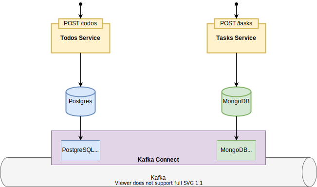

# Introduction
Often in a <a href="https://microservices.io/patterns/microservices.html">Microservice Architecture</a>, a service must atomically update the database
and send messages in order to avoid inconsistencies. A solution to this problem is given by the <a href="https://microservices.io/patterns/data/transactional-outbox.html">Outbox Pattern</a>,
which states that each service must insert messages into an outbox table/collection as part of the local transaction.

# Implementation
<p align="center">
    
</p>
To ensure that messages are sent to the message broker, this example use <a href="https://debezium.io/">Debezium</a>, which streams data changes to Kafka.

Debezium offers connectors for many databases such as MySQL, PostgreSQL, SQLServer, MongoDB, Cassandra and others.
Some predefined Single Message Transformations (SMT) are offered by Debezium to define the structure of the messages sent to the message broker.
However, this implementation use two custom SMT to ensure more flexibility.

In this example there are two services: Todos and Tasks. Each one offers a REST endpoints that creates a new aggregate and publishes an event.
For simplicity each service handles its own events.

# Other considerations
Implement this pattern for services which use relational databases is pretty straightforward.
The problems raise with NoSQL databases which might not have a rich transactional model.

For example MongoDB introduced multi-document transactions only in version 4.0. If a database doesn't permit such operations, a possible solution
might be to save outbox events in the aggregate. For example, in document-oriented databases a document can have a nested field which stores outbox events
for the specific aggregate.

This implementation uses Mongo v4.4 and multi-document transactions. However, this can incur in greater performance costs as stated in the <a href="https://docs.mongodb.com/v4.4/core/transactions/">official documentation</a>.

# Try it
You must have Docker and Docker Compose installed.

Now from the root folder:
```shell
./gradlew build jibDockerBuild
docker-compose up --build
./register-all-connectors.sh # Register all the debezium connectors
./create-todo.sh # Send a request to the Todos Service
./create-task.sh # Send a request to the Tasks Service
```
You should see from logs that each service handled its own events.